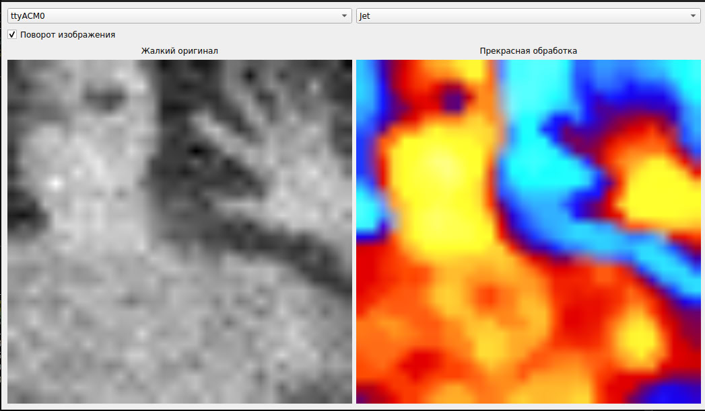

Read in other languages: [Russian](README.ru.md)

# QtIOP-01
# Program for processing data from a thermal imager

## Description
This program is designed to read data from TIOP-01, process it and display it in a video image.
Data from the thermal imager is transmitted via the serial port (COM port) of the computer.
The program uses OpenCV for image processing and Qt for creating a graphical interface.

Compiled with Qt 5.15.15, tested under Ubuntu 20.04. Under Win10/11 the port stubbornly keeps silent, I couldn't get any information from it either in the terminal or in this app.

## Functionality
1. **Reading data**: the program reads data from the serial port.
2. **Processing data**:
- Normalization of temperature measurements.
- Smoothing the image with a Gaussian filter.
- Using a color map to visualize temperature data.
- Filtering noise with a median filter.
- Improving image contrast and brightness.
3. **Display**: The processed data is presented as a color image, the original temperature data is in grayscale.

## Installation
to be done
